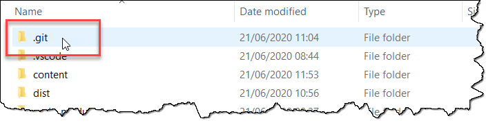
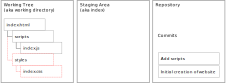
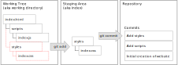

# Basic Commands

Getting started with basic Git commands


## Creating a Git repository

* Two options <!-- .element: class="fragment" -->
  * Start from scratch: `git init` ([ref](https://git-scm.com/docs/git-init))
  * Clone existing repository: `git clone <repository>` ([ref](https://git-scm.com/docs/git-clone))
* Folder <!-- .element: class="fragment" --> *.git*
  * Contains Git database
  * Don't delete or manipulate

 <!-- .element: class="fragment" -->


## Tips for New Repositories

* Get repository name from GitHub
  


## Tips for New Repositories

* Add <!-- .element: class="fragment" --> a *.gitignore* file ([ref](https://git-scm.com/docs/gitignore))
  * Add all files to ignore
  * Generate using [https://gitignore.io/](https://gitignore.io/)
* Add <!-- .element: class="fragment" --> a *readme.md* file
  * Describe the content of the repository using [Markdown](https://en.wikipedia.org/wiki/Markdown)
* Add <!-- .element: class="fragment" --> a *LICENSE.md* file
  * License for the content of your repository
  * Especially important for public repositories
  * [https://choosealicense.com/](https://choosealicense.com/) might be helpful
* Specify <!-- .element: class="fragment" --> folder name when cloning
  * Default: Repository name = folder name
  * Optional: Specify alternate folder name after repository (`git clone <repository> <folder>`)


## Aliases

* Alias = abbreviation for long Git commands ([ref](https://git-scm.com/book/en/v2/Git-Basics-Git-Aliases))
  * Tip: Google for *git must have aliases* to get suggestions

```bash
git config --global alias.cl clone
git cl https://github.com/rstropek/git-fundamentals.git
```


## Overview

| Git Command                                         | Description                                                             |
| --------------------------------------------------- | ----------------------------------------------------------------------- |
| [`status`](https://git-scm.com/docs/git-status)     | Displays paths/files that have differences (created, modified, deleted) |
| [`add`](https://git-scm.com/docs/git-add)           | Adds changes (creations, modifications, deletions) to staging area      |
| [`commit`](https://git-scm.com/docs/git-commit)     | Records changes from staging area to the repository                     |
| [`log`](https://git-scm.com/docs/git-log)           | Shows list of commits                                                   |
| [`diff`](https://git-scm.com/docs/git-diff)         | View changes                                                            |
| [`checkout`](https://git-scm.com/docs/git-checkout) | Restore files from a commit                                             |
| [`show`](https://git-scm.com/docs/git-show)         | Show content of a commit                                                |
| [`revert`](https://git-scm.com/docs/git-revert)     | Reverts changes of a commit                                             |
| [`tag`](https://git-scm.com/docs/git-tag)           | Maintains tags for commits                                              |
| [`stash`](https://git-scm.com/docs/git-stash)       | Stash changes away                                                      |


## `git status` ([ref](https://git-scm.com/docs/git-status))

* Displays <!-- .element: class="fragment" --> paths/files that have differences (created, modified, deleted)
* Use <!-- .element: class="fragment" --> `--short` flag to get a compact overview
* Consider <!-- .element: class="fragment" --> using a GUI tool to explore status of repository
  * E.g. *Source Control* secition in VSCode

 <!-- .element: class="fragment" -->


## `add` and `commit` Workflow <!-- .slide: data-transition="slide-in fade-out" -->


## `add` and `commit` Workflow <!-- .slide: data-transition="fade" -->




## `add` and `commit` Workflow <!-- .slide: data-transition="fade" -->


## `add` and `commit` Workflow <!-- .slide: data-transition="fade-in slide-out" -->




## `git add` ([ref](https://git-scm.com/docs/git-add))

* Add <!-- .element: class="fragment" --> a single change (creation, modification): `git add index.html`
* Add <!-- .element: class="fragment" --> all changes in current folder and subfolders: `git add .`
* Add <!-- .element: class="fragment" --> a file that would otherwise be ignored (.gitignore): `git add --force style.css`
* Add <!-- .element: class="fragment" --> all changes including deletions: `git add --all .`
  * `--ignore-removal` would otherwise be the default
  * Alternative: Use separate [`rm`](https://git-scm.com/docs/git-rm) or [`mv`](https://git-scm.com/docs/git-mv) commands


## `git commit` ([ref](https://git-scm.com/docs/git-commit))

* Commit <!-- .element: class="fragment" --> with message: `git commit -m 'Add styles'`
* Commit <!-- .element: class="fragment" --> all changes without having to separately call `add` and/or `rm`: `git commit -a -m '...'`
* Amend <!-- .element: class="fragment" --> (=replace) last commit: `git commit --amend -m '...'`


## `git revert` ([ref](https://git-scm.com/docs/git-revert)) and `git reset` ([ref](https://git-scm.com/docs/git-reset))

* Revert <!-- .element: class="fragment" -->
  * Revert changes that a commit introduced and record reverting in a new commit
  * Tip: Use `-n` switch to just do the edits without commit
  * Revert changes of the fourth last commit: `git revert HEAD~3`
  * Revert changes from fifth to to the third last (included) commit: `git revert master~5..master~2`
* Reset <!-- .element: class="fragment" -->
  * Can be used to undo local changes
  * Undo local edits: `git reset --hard`


## Exercises, Further Readings

* Exercises
  * [Lab: Building a Website in a Local Repository](https://github.com/rstropek/git-fundamentals/blob/master/content/labs/0020-local-repo.md)
  * [Lab: Building a Simple Game in a Local Repository](https://github.com/rstropek/git-fundamentals/blob/master/content/labs/0030-tags-stashing.md)
* Further readings:
  * [*Git Basics* in Git book](https://git-scm.com/book/en/v2/Git-Basics-Getting-a-Git-Repository)
