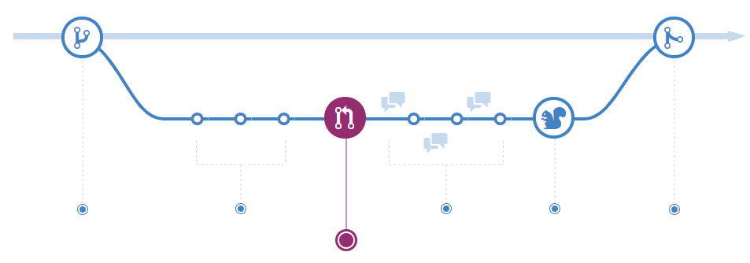

# Git GitHub Flow

Teamworking with Git, part 2

## [The GitHub Flow](https://guides.github.com/introduction/flow/)

## [The GitHub Flow](https://guides.github.com/introduction/flow/)

* Pull <!-- .element: class="fragment" --> requests are created from branches or forks.
  * If you create a fork, create a branch in your fork.
* Add <!-- .element: class="fragment" --> commits to your individual branch.
* Open <!-- .element: class="fragment" --> a pull request from your branch/fork.
  * Use *@name* to ask specific people for help/review.
  * Pull request is now discussed/reviewed.
* Deploy <!-- .element: class="fragment" --> your branch into test or production.
  * Test the new version.
  * Roll back to master in case of problems.
* Merge <!-- .element: class="fragment" --> pull request into master.
  * [Link pull request](https://help.github.com/en/github/managing-your-work-on-github/linking-a-pull-request-to-an-issue) to corresponding issues.

## Exercises, Further Readings

* Exercises
  * [Lab: *Building a Scale Unit Converter*](https://github.com/rstropek/git-fundamentals/blob/master/content/labs/0060-pull-request.md)
* Further readings:
  * [*GitHub Flow* in GitHub docs](https://guides.github.com/introduction/flow/)
