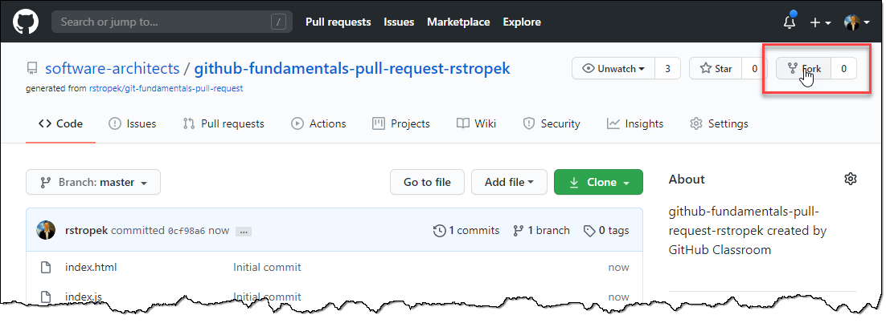
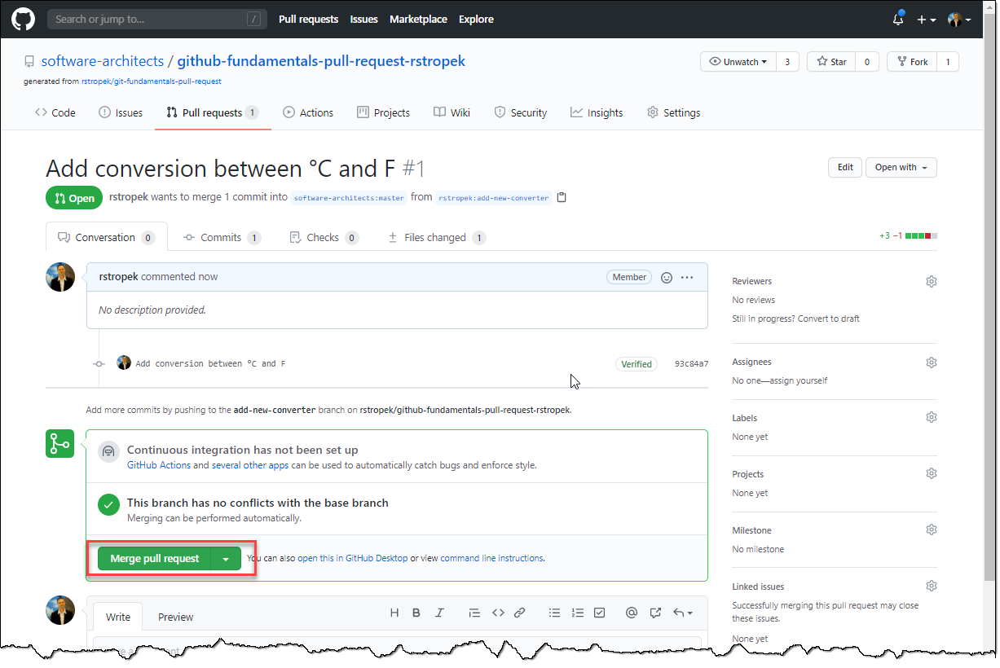

# Building a Scale Unit Converter

## Introduction

In this lab we are building a scale unit converter in teams. We are going to use *Pull Requests* for that.

This lab assumes that you are already familiar with basic Git commands as shown in the previous [*Building a Simple Game with Branching* lab](0050-branching.md).

## Form Teams

Work on this exercise in teams. Group in teams of two to five people. One person will be the *repository maintainer*. The other people will contribute to the project by sending a *pull request*.

## Create Base Repository on GitHub

**This step has to be done by the *repository maintainer*.**

To get started for this lab, create your own GitHub repository with starter code based on a template that has been created for you. To create your starter code repository, visit [https://classroom.github.com/a/1fA0uUwO](https://classroom.github.com/a/1fA0uUwO) and *accept the assignment*. As a result, a new GitHub repository will be created containing the starter code for this lab.

**Share the link to the created repository with the contributors.**

## Create Fork

**This step has to be done by all *contributors*.**

* Open GitHub repository that the *repository maintainer* gave you.
* Create your own fork.

## Create Branch

**This step has to be done by all *contributors*.**

* In *your fork*, create a branch *add-new-converter*.

## Add Converter

**This step has to be done by all *contributors*.**

* In *your fork* in the *add-new-converter* branch, edit the *index.js* file. You can use GitHub's online editor for that.

* Add a converter. Here is an example for a °C to F converter. Each contributor should come up with her own converter.

## Create a Pull Request

**This step has to be done by all *contributors*.**

* Go to home page of *your fork*.
* Compare your changes and create a pull request.

* Describe your changes and initiate pull request.

## Merge Pull Request

**This step has to be done by the *repository maintainer*.**

* Go to *Pull Requests* in your repository.
* Inspect and merge the pull request.
* If you want, try code view features of GitHub.

* If necessary, fix conflicts.
* Try the extended app.
